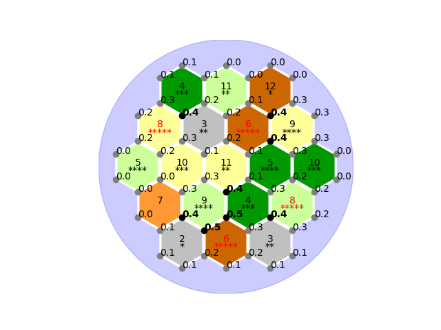

# CatanMonteCarlo

  

Tool to simulate and visualise Monte Carlo for a standard Catan game. Simulates `n` 2xd6 dice rolls for a given board configuration, and returns the ratio of total resource gains v.s. `n` dice roll for each hexagonal vertex on the board.

## Dependencies
* `matplotlib` to generate visualisation
* `numpy` for geometric calculations

## Usage
### a random placement with 1000 2xd6 dice rolls
`python3 app.py --random_placement --n_simulations 1000`

### a configured placement with 50 2xd6 dice rolls
(placement of the board in the header)
`python3 app.py --string_placement 4l-11w-12b-8g-3o-6b-9g-5w-10g-11g-5l-10l-7d-9w-4l-8w-2o-6b-3o --n_simulations 50`

The parameter provided to `--string_placement` is of the format `<dice_odds_1><resource_letter_1>-<dice_odds_2><resource_letter_2>-...-<dice_odds_19><resource_letter_19>`, where tile 1, 2 ... 19 goes from left to right, top to bottom.

Resource letters:
* `l` - lumber
* `w` - wool
* `b` - brick
* `g` - grain
* `o` - ore
* `d` - desert (dice odd is always 7)
